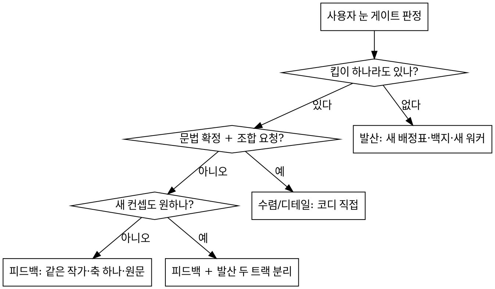

# Design Variant Rounds — 시안 라운드

## 개요

여러 변형을 병렬로 만들어 **compare 한 장**에서 비교하고, 라운드를 돌려 확정하는 방식. 핵심 원리 둘:

1. **발산은 병렬이 싸고, 개선은 작가 연속이 싸다.** 첫 라운드는 백지·새 워커·직교 논제로 벌리고, 그 다음 라운드는 **같은 작가가 자기 안을 키운다.** 낯선 워커에게 사본을 주는 라운드는 개선이 아니라 재작성이다.
2. **코디네이터는 브리프·중계·비평만 한다.** 기반을 짓지 않고, 피드백을 조문으로 번역하지 않고, 게이트를 늘리지 않는다. 코디의 해석이 끼는 순간 변형 N벌은 코디의 안 하나가 된다.

실측 근거(2026-09, 두 무대 37벌): 백지 라운드의 슬롯 간 코드 유사도 0.12~0.19 → 사본 라운드 0.30~0.36 → 픽셀 게이트 라운드 0.74. 사용자 판정은 같은 순서로 «좋다 → 고만고만 → 퇴보 → 다 똑같다»였다. 뿌리는 워커가 아니라 라운드 2 이후의 엔진이었다.

## 라운드 엔진 4종

| 엔진 | 언제 | 작가 | 출발점 | 자유도 | 게이트 |
|---|---|---|---|---|---|
| **발산** | 첫 라운드 · «전부 아니다, 완전 새로» | 새 워커 3~5 | 백지 | 논제 하나씩(배정표) | R1 세트 |
| **피드백** | «X 좋다, 여기가/이것만» · «너무 복잡» · «심심» | **같은 작가**(세션 유지 또는 재수화) | 자기 파일 | 축 하나 · ≤3벌 | R1 세트 **그대로** |
| **수렴** | 문법 확정 · 후보 충분 · «A의 X와 B의 Y» | 코디 직접 | 킵 안들 | 조합 신규 1안 | R1 세트 |
| **디테일** | 확정안의 액션·카피·마이크로 UX | 코디 직접 + 실시간 왕복 | 확정안 | 한 항목 수술 | R1 세트 |



«킵 하나 + 새 컨셉»은 두 트랙을 **분리**한다. 킵의 사본을 새 컨셉의 출발점으로 주는 것이 가장 나쁜 조합이다(실측: 그 라운드가 «퇴보»로 전량 기각).

## 불변 원칙

1. **독립 시행(발산)** — 슬롯마다 단일 자립 HTML, 공유 CSS·마크업 0, 다른 슬롯 열람 금지. 공통은 토큰 어휘·목 데이터·계약뿐.
2. **작가 연속(피드백)** — 다음 라운드는 같은 하네스, 같은 작가. 세션이 죽었으면 재수화한다(Phase 4).
3. **축 하나** — 라운드마다 이름 붙인 주축 하나. 부차 선택은 따라온다. `references/round-rules.md`.
4. **바닥선은 고정이고 축이 아니다** — `references/craft-floor.md` + 씨드 계약. 라운드가 쌓여도 바닥선은 늘지 않는다.
5. **코디는 기반을 짓지 않는다** — 병렬 변형의 출발점을 코디가 만들면 사용자가 고른 안이 코디의 안으로 바뀐다. 코디 직접 제작은 수렴·디테일 엔진에서만.
6. **피드백은 원문으로** — 사용자 문장을 그대로 넘긴다. 코디의 번역은 «어느 엔진인가»와 절차 포인터 한 줄뿐. `references/feedback-translation.md`.
7. **게이트는 R1 세트에서 늘지 않는다** — 외부 요청 0 · 크롬 블록 해시 · 어휘 · 실동작 프로브 · 검출기 · 모션 grep. 픽셀 diff·밀도 상한·훅 필수·요소별 상이성 표는 만들지 않는다.
8. **주소는 compare 한 장** — 슬롯 개별 주소를 나열하지 않는다. 미착지 슬롯은 «작업 중» 자리 표시.
9. **살아 있는 화면만** — 1차 상호작용이 전부 실동작하고 반응이 눈에 띈다. 정적 캡처식 시안은 반려.
10. **무대는 프로젝트 공간** — `<repo>/design-rounds/<주제>/`. `/tmp`·스크래치패드 금지(시스템 정리로 소실된 실측 사고). 중요 시점마다 시안 파일만 걸러 임시 커밋.

## 역할 계약

코디네이터가 **하는 일**: 브리프(`references/brief-template.md`) · 배정표(`references/thesis-divergence.md`) · 씨드팩 조립 · 기동 확인 · 수령 판정(`references/review-template.md`) · 사용자 원문 중계 · 수렴·디테일 라운드의 직접 제작 · 결정 기록(`references/decision-record.md`).

코디네이터가 **하지 않는 일**: 변형의 출발 파일(«공통 기반») 제작 · 피드백의 수정 목록화 · 계약에 구조·픽셀·밀도 조문 추가 · 브리프에 값이 채워진 «축 표» · 리뷰에 간격·폭·위치 지시 · 표에 선호 표시.

워커가 **하는 일**: 첫 행동으로 씨드가 지정한 디자인 스킬(`frontend-design`) 로드 → 씨드 정독 → 자기 논제·자기 축으로 제작 → 자가 검사(check · detect.mjs · 모션 표) → v1 착지 보고 → 리뷰 읽고 v2 → 완료 보고.

**하네스 어댑터.** 워커를 띄우고, 후속 메시지를 보내고, 착지를 감시하고, 스크린샷을 찍는 명령은 하네스마다 다르다. 라운드 시작 때 어댑터 하나를 고르고 그 파일의 명령만 쓴다: Orca가 있으면 `references/harness-orca.md`(워커 터미널이 보여 기동 확인이 가장 정확), Claude Code만 있으면 `references/harness-claude-code.md`(Agent 도구 + 같은 에이전트에 후속 메시지), 둘 다 아니면 `references/harness-generic.md`(사람이 여는 세션 N개). 어댑터가 «같은 워커에게 후속 메시지»를 못 하면 Phase 4의 재수화로 작가 연속을 지킨다.

**어댑터 판정(라운드 시작 때 한 번, 관찰 가능한 순서로)**: ① 사용자가 어댑터를 지정했으면 그것. ② `command -v orca`가 성공하고 `orca orchestration --help`가 응답하면 Orca. ③ 그렇지 않고 이 세션에 서브에이전트 기동 도구(Agent)와 같은 에이전트에 후속 메시지를 보내는 도구(SendMessage)가 있으면 Claude Code. ④ 둘 다 아니면 범용. 고른 어댑터와 근거를 씨드 머리에 한 줄 적는다(예: «어댑터 = Orca · `orca` 0.x 확인»). 라운드 중간에 바꾸지 않는다.

## Phase 0 — 착수

1. **브리프 7항**을 사용자와 1~2회 왕복으로 채운다(`references/brief-template.md`). CSS 값·미적 레인은 묻지 않는다.
2. **라운드 유형 판정**: 새 주제면 발산. 기존 라운드가 있으면 위 흐름도.
3. 발산이면 **논제 발산 → 직교 검사 → 배정표**(`references/thesis-divergence.md`). 슬롯 3~5, 브리프는 «논제 + 정보구조는 네가 + 은유 + 금지문 = 다른 슬롯 논제 + 시그니처».
4. **사용자 확인 후 기동.** 확인 전 무기동.

## Phase 1 — 무대

```
<stage>/
├─ compare.html      # 항상 이것 하나만 사용자에게 준다 (assets/compare-template.html)
├─ _seed/            # seed.md · standards.md · brief-*.md · review-*-v1.md · task-template.md · check.py
├─ a/ b/ c/ …        # 슬롯 — index.html 하나씩, 자리 표시로 사전 시딩
└─ _archive/         # 탈락·중간 세대 (지우지 않는다)
```

- compare 문법: iframe fixed inset:0 + width/height 100%, 우하단 독 스위처, 전환마다 `?t=Date.now()` 캐시 우회, 키보드 1~N.
- 서버: 무대 폴더에서 `nohup python3 -m http.server <port>` 분리 프로세스.
- **주소를 주기 전에 렌더를 실측**(HTTP 200 ≠ 렌더 정상): 스크린샷 1장(도구는 어댑터 §실측).
- **실측 크롬**: 사이드바·헤더 수치는 캡처 짐작 금지, 소스 실측(레티나 배율 함정 95 vs 60px). 크롬은 마커 블록(`<!-- CHROME vN START/END -->`)으로 한 벌, 워커가 verbatim 삽입, 기계 검사는 해시 비교. 시안 컨트롤(슬롯 배지·시점 토글)은 뷰포트 밖 고정 독으로.

## Phase 2 — 발산 라운드 제작

**씨드팩(`_seed/seed.md`)에 전부 인라인**해 워커 탐색을 0으로. 순서:

1. 브리프 7항 (Phase 0)
2. 토큰 실값(디자인 시스템 패키지에서 hex 직접 추출 · 폰트 · 라운드 · 타이포 위계)
3. 목 데이터(엣지 포함 · 실제 도메인 문구)
4. 도메인 규칙(상태 모델 · 권한 · 액션 어휘)
5. 공통 계약(기계 검사 대상: 단일 파일 자립 · 외부 요청 0 · 크롬 블록 verbatim · 시점 토글 · 어휘·금지 문구)
6. 바닥선 예외 목록(계약이 요구해 `craft-floor.md` Refuse에서 예외인 요소 + detect.mjs 무시 규칙)
7. 실동작 ①~⑨
8. 워커 로드 순서: `frontend-design` 스킬 → `references/operate-mode.md`(제품 UI면) → `references/round-rules.md` → `references/craft-floor.md`(방향이 정해진 뒤) → `references/motion-decisions.md`(모션을 넣을 때)

**발산 task spec 계약** — 이 순서, 이 부품:

```
1 역할 한 줄(슬롯 이름 · 논제 한 구절) · 코드베이스 탐색 금지, 아래 파일만
2 첫 행동 = frontend-design 스킬 로드 (로드 방법은 어댑터 · 기동 확인에서 실측)
3 정독 순서(절대경로): seed.md → brief-<slot>.md → standards.md → references 4개
4 백지 신축: 다른 슬롯 폴더·현행 구현 열지 않음 · 산출 = <slot>/index.html · <body data-slot>
5 살아 있는 화면: 실동작 ①~⑨ · 상태 N개 · 전이가 같은 파일 안에서 실동작
6 자가 검사: check.py PASS · node scripts/detect.mjs --json --no-config <file>(무시 목록 적용) · 모션 표
7 v1 착지 → 착지 보고 → review-<slot>-v1.md 생기면 읽고 v2 → 완료 보고(논제 · 시그니처 · 실동작 자가 체크 · 못 지킨 계약과 이유) → 턴을 끝내고 후속 메시지를 기다린다
8 git 금지 · 다른 파일 생성 금지(<slot>/_wip/ 만)
```

**기동은 어댑터의 명령으로.** 어느 어댑터든 다음 넷은 같다.

- **기동 확인(생략 금지)**: 기동 직후 ① 프롬프트가 실제로 제출됐는지 ② 지정 모델인지 ③ 씨드가 요구한 스킬을 로드했는지. 터미널이 보이면 로그로, 안 보이면 워커의 첫 상태 파일(`<slot>/_wip/status.md`)로. 없으면 시정 메시지.
- **대기**: heartbeat는 소음이다. 착지 = 슬롯 파일 크기 안정화(수 초 간격 연속 동일), 정산 = 워커의 완료 보고. 변화가 있을 때만 한 줄 통지.
- **후속 메시지**: 같은 워커에게 보낼 수 있어야 한다(작가 연속의 전제). 계약 개정도 라운드 중 같은 경로로 통지한다.
- **릴리스**: 눈 게이트 판정 전에는 릴리스하지 않는다.

## Phase 3 — 수령 판정 (하나라도 실패 = 반려)

1. **기계 검사**(R1 세트, 이후 라운드에도 이것만): 외부 요청 0 · 크롬 블록 해시 · 어휘·금지 문구 · `node scripts/detect.mjs --json --no-config <file>`(무시 목록 적용, 매치를 읽고 판정) · 모션 grep(`references/motion-decisions.md` 코디 절).
2. **렌더 실측**: 스크린샷(어댑터 §실측) → 직접 눈으로. 엣지 상태 화면 포함.
3. **동작 실측**: 핵심 클릭 5~7개를 브라우저 스크립트로 실행, 전/후를 시각으로. 계측이 눈보다 정확한 항목은 계측.
4. **리뷰 문서**: `references/review-template.md` 그대로. 강점 2~3(동결 후보) · 우선 이슈 3~5(P0~P3, 해로움 한 줄) · v2 요구 ≤5. 조형 지시 없음.
5. **재스킨 판정**(발산만): 헤드라인 교환 테스트. 텍스트 유사도 수치는 근거가 아니다.

수령은 **정산(완료 보고) 후 최종판에서**. 착지 직후 중간판에 동작 프로브를 돌리면 마감 수정과 경합한다. 통과한 슬롯은 즉시 개별 보고. compare 안내에는 변형마다 «맞는 때 / 비용»만.

**프로브 함정 4종**: ① 트리거 탐색은 글리프(⋯)만 믿지 말 것, aria-label이 다를 수 있다 ② 헤드리스 브라우저의 스크립트 평가기는 옵셔널 체이닝·화살표 함수에 취약할 수 있다, ES5풍 + 단계 분해 ③ innerText는 width:0 요소를 포함한다, 시각 소멸은 offsetWidth로 ④ 등장 애니메이션 클래스는 더블 rAF 뒤에 붙는다.

## Phase 4 — 피드백 라운드 (라운드 2 이후의 정본)

사용자 눈 게이트 판정을 받으면 `references/feedback-translation.md` 표로 **엔진만** 고른다. 피드백 엔진이면:

**작가 확보**
- 세션이 살아 있으면: 그 워커에게 아래 spec을 후속 메시지로 보낸다(어댑터 §후속 메시지). 새 워커 기동이 아니다.
- 세션이 릴리스됐으면 **재수화**: 새 워커를 띄우되 spec은 «너는 `<slot>/index.html`의 작가다. 네 원 브리프 `brief-<slot>.md`와 네 v1 리뷰 `review-<slot>-v1.md`를 읽고, 사용자 원문을 받아 **네 안을 네 손으로** 키워라». 출발 파일은 자기 파일뿐이다. 다른 슬롯에 그 파일을 주지 않는다.
- 킵 하나로 변형 여러 벌을 원하면: 같은 작가가 ≤3벌을 축 하나에서 갈라 만든다(`<slot>-1/ -2/ -3/`). 새 워커 N명에게 사본을 나누지 않는다.

**피드백 task spec 계약** — 이 순서, 이 부품, 이것만:

```
1 «너는 <slot>의 작가다» + 사용자 판정 원문(따옴표 그대로, 요약 금지)
2 킵 목록: 리뷰 §6 강점 + 사용자가 칭찬한 요소 (동결 — 건드리면 diff 먼저)
3 이번 라운드의 축 하나(이름) + 벌 수(≤3) + 각 벌의 이름
4 절차 포인터 한 줄 (feedback-translation.md 표의 해당 행: distill 4문 / polish 원칙 / bolder)
5 게이트: R1 세트 그대로 (추가 없음을 명시)
6 착지·보고 절차 (Phase 2 의 7·8 과 동일)
```

spec에 들어가지 않는 것: 수정 목록 · «바꾸는 자리 / 이 밖은 그대로» · 픽셀·밀도·훅 요구 · 다른 슬롯의 파일 · 코디가 그린 스케치.

**계약 개정**: 어휘·데이터 사실·기계 검사 문자열 수준만 부록으로. 구조 동결 조문(«칩 조형 유지» «두 열 픽셀 동일»)은 쓰지 않는다. 사용자가 구체 값을 말했으면 원문의 일부로 전달하되 계약으로 승격하지 않는다.

**두 트랙**(킵 + 새 컨셉): 킵 작가는 위 spec, 새 컨셉은 Phase 0의 발산(새 배정표·백지·새 워커). 두 트랙은 파일도 워커도 공유하지 않는다.

## Phase 5 — 수렴·디테일 (코디 직접)

후보가 충분하고 문법이 확정되면 경쟁을 멈추고 «전부 킵 + 피드백 조합 신규 1안»을 코디가 직접 짓는다. 디테일은 **기능 지도 선행**(대상 기능의 실구현 전수 분석 → 버튼·문구·정책 인벤토리 → 계약 확정 → 수술) + 항목 하나 고치고 스크린샷으로 확인받는 실시간 왕복. 워커 병렬은 조형 크래프트에 상한이 있다(실측: 크래프트 목적 라운드 폐기).

- **확정·칭찬된 요소는 동결** — 건드려야 하면 커밋 원판 diff를 먼저 뜨고 영향을 고지한 뒤. 공용 클래스로 부수효과가 흐르면 요소별 스타일 분리(중복 감수).
- **상태 있는 컴포넌트의 캡처는 어느 상태인지 먼저 판별**(hover 캡처를 디폴트로 오독 → 왕복 2회 사고). 애매하면 묻는 게 싸다.
- **«원래 이랬어?»는 질문이지 원복 지시가 아니다** — diff로 답하고 방향을 받는다.

## 마감

확정안을 정식 구현 라운드로 인계. `references/decision-record.md`로 결정 기록(구현 라운드의 입력). 탈락·중간 세대는 `_archive/`, compare는 확정안 직행. 시안만 걸러 커밋(무관한 소스 변경과 섞지 않는다). 무대 서버 종료(사용자 확인 후), 워커 릴리스, 계약 부록에는 확정으로 굳은 것만.

## 합리화 표 — 이 말이 떠오르면 멈춘다

| 떠오르는 말 | 실제 |
|---|---|
| «사본에서 시작하면 빠르다» | 사본은 뼈대를 상속해 «고만고만»을 만들고, 낯선 워커는 결국 재작성한다(사본 라운드 공유 줄 17~20%). 라운드를 하나 더 태우는 지름길 |
| «워커가 릴리스됐으니 새로 띄울 수밖에» | 재수화(자기 파일 + 원 브리프 + 원문)가 새 워커보다 싸다. 새 워커는 이해에 15분 중 5분을 쓴다 |
| «피드백 N건은 조문으로 써야 정확히 반영된다» | 조문은 동결이다. 원문 + 킵 목록으로 작가가 반영한다. 조문은 작가를 패처로 만든다 |
| «픽셀 게이트가 없으면 변형이 흩어진다» | 흩어짐을 막는 것은 축 하나·이름·헤드라인 교환 테스트다. 픽셀 게이트는 유사도 0.74를 만든다 |
| «밀도 상한을 걸어야 복잡함이 준다» | 상한은 글자를 줄이지 위계를 만들지 않는다. distill 4문이 위계를 만든다 |
| «기반을 내가 지으면 품질이 보장된다» | 사용자가 고른 안이 코디의 안으로 바뀐다(«변형 몫 제거» 되돌림 사고). 코디는 기반을 짓지 않는다 |
| «상이성 표로 슬롯끼리 다르게 만들자» | 요소 단위 상이성은 «다름을 위한 다름»이다. 다름은 축에서 온다 |
| «시간이 없으니 수정 목록으로 빨리 가자» | 목록은 시간을 줄이지 않는다(사본 라운드 착지 6~16분 vs 백지 1~6분). 시간이 없을수록 원문 + 축 하나 |
| «최고 품질로 뽑으려면 실스펙 전부를 보여 줘야» | 품질은 정보량이 아니다. «하나의 아이디어가 한 사람 단위로 읽히는가»다(실측: 정보 폭발 라운드 전량 기각) |
| «살아 있는 워커를 재사용하면 씨드 정독 비용이 0이다» | 정독 비용이 0인 워커는 자기 안의 작가뿐이다. 남의 논제를 받은 워커는 자기 안의 뼈대를 그대로 들고 온다. 재사용은 «같은 작가에게 자기 안»일 때만 |
| «뼈대 상속은 ‹다른 슬롯 폴더를 열지 말라›로 끊긴다» | 상속은 파일이 아니라 코디의 축 표·수정 목록·공용 기반을 타고 온다. 열람 금지는 발산의 조건이지 피드백 라운드의 면죄부가 아니다 |
| «코디가 최소 수술만 한 공용 기반이라 괜찮다» | 이름이 E1이든 E2든 사용자가 고른 안이 코디의 안으로 바뀐다. «최소»는 워커 5명에게 복제되는 순간 최대가 된다 |
| «퇴보의 뿌리는 사본이 아니라 논제·공통 수정이었다, 그러니 이번엔 사본 + 다른 논제» | 사본·공통 수정·낯선 워커는 한 묶음이다. 하나만 빼고 되풀이하면 같은 결과가 이름만 바꿔 나온다 |
| «지적을 grep 가능한 조문(≤N자·간격 최소값·마킹 의무)으로 써야 수령에서 잡힌다» | 수령에서 잡히는 것은 «지적이 사라졌는가»이지 «숫자를 지켰는가»가 아니다. 조문은 이번 반려의 이유를 다음 라운드의 상한으로 바꿔 작가를 패처로 만든다 |

## 레드 플래그 — 하나라도 보이면 spec을 다시 쓴다

- task spec에 «사본» «출발 = `<다른 slot>/index.html`» «이 밖은 그대로» «픽셀 동일» 문구
- 계약 부록에 «≤ N자» «≤ N잎» «≤ N상자» 숫자, 또는 «~ 유지» «~ 그대로» 동결 조문
- 브리프에 칸이 채워진 «축 표»(카드 조형·알약·행 높이…)
- 코디가 무대에 새 `index.html`을 쓴다(수렴·디테일 엔진이 아닌데)
- 리뷰에 «X를 Y로 바꿔라» 간격·폭·위치 값
- 새 워커 N명 + 같은 출발 파일
- task spec 어디에도 사용자 원문이 따옴표로 없다
- 슬롯 이름이 «옵션 A/B/C»

## 지뢰 요약 (실측 사고 이력)

| 지뢰 | 처치 |
|---|---|
| 워커 기동 뒤 프롬프트 미제출(Enter 레이스) | 10초 뒤 확인, 미제출이면 다시 제출 |
| 씨드의 스킬 로드 지시 무시 | 기동 확인에서 로드 로그 실측 + 시정 |
| HTTP 200을 렌더 정상으로 착각 | 주소 전달 전 스크린샷 |
| 사본 개작 → 변형 수렴 | 발산은 백지, 개선은 같은 작가 |
| 크래프트 목적 라운드를 워커 병렬로 | 코디 직접 수술 + 실시간 왕복 |
| 공용 스타일 수정이 확정 요소를 오염 | 동결·diff 선행·요소별 스타일 분리 |
| hover 캡처를 디폴트로 오독 | 상태 판별 먼저 |
| 완료 대기가 heartbeat에 조기 종료 | 변화시만 통지하는 감시(어댑터 §대기) |
| 정산 전 중간판에 동작 프로브 | 완료 보고 후 최종판 |
| 브라우저 캐시로 옛 슬롯 | 모든 전환·새로고침에 `?t=` |
| 개별 슬롯 주소 나열 | compare 한 장만 |
| /tmp 무대가 시스템 정리로 소실 | 프로젝트 공간 + 임시 커밋 |
| 캡처로 앱 크롬 수치 짐작 | 소스 실측 |
| 검출기 «gradient-text»가 제품 AI 마크를 잡음 | 씨드 예외 목록 + 무시 규칙(계약이 이긴다) |

## 파일 지도

| 파일 | 누가 · 언제 |
|---|---|
| `references/round-rules.md` | 워커·코디 · 매 라운드 |
| `references/craft-floor.md` | 워커 · 방향이 정해진 뒤, 제작 직전 |
| `references/operate-mode.md` | 워커 · 제품 UI일 때(frontend-design과 충돌 시 이것이 이김) |
| `references/motion-decisions.md` | 워커 · 모션을 넣을 때 / 코디 · 수령 grep |
| `references/brief-template.md` | 코디 · Phase 0 |
| `references/thesis-divergence.md` | 코디 · 발산 라운드 배정표 |
| `references/review-template.md` | 코디 · Phase 3 |
| `references/feedback-translation.md` | 코디 · Phase 4 엔진 판정 |
| `references/decision-record.md` | 코디 · 마감 |
| `references/harness-orca.md` | 코디 · Orca가 있을 때의 기동·확인·대기·후속 메시지 |
| `references/harness-claude-code.md` | 코디 · Claude Code만 있을 때(Agent 도구 + 후속 메시지) |
| `references/harness-generic.md` | 코디 · 그 밖의 에이전트·수동 세션 |
| `scripts/detect.mjs` | 워커 자가 검사 · 코디 기계 검사 (`--json --no-config`) |
| `assets/compare-template.html` | 코디 · Phase 1 |
| `NOTICE.md` | 출처·커밋·라이선스 |
